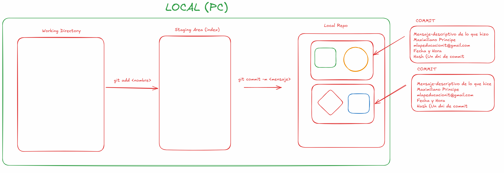

# Clase 01 - Git Desarrollador Colaborativo

# Markdown (MD)

# h1
## h2
### h3
#### h4
##### h5

## Verificando que tenga git instalado

```sh
git --version
```

## Configuración inicial (Se hace una sola vez)

```sh
git config --global user.name "Maxiliano Principe"
git config --global user.email mlapeducacionit@gmail.com
```

## Verificar si ambas variables existen y su valor

```sh
git config --global user.email
git config --global user.name

## Otra manera
git config --get-regexp user
```

## Verificar el editor que estoy usando con GIT

```sh
git config --global core.editor
```

## Cambiar al editor nano

```sh
git config --global core.editor nano
```

## Ver las configuraciones hechas en GIT

```sh
git config --global -e
```

## Inicializar un repositorio de GIT

```sh
git init
```

## Ver el estado de los archivos y en que área están los archivos

```sh
git status
```

## Estados de los archivos

* Untracked (Sin seguimiento) => archivos que no se agregaron al index/stage y por consecuente no se les da seguimiento.
* Staged => Archivos que fueron agregados al index/stage area y cuyos cambios van a ser incorporados al repositorio
* Unmodified => Archivos que se cuentran en en el respositorio y no fueron modificado (Con respecto al repositorio)
* Modified => Archivos que se encuentro en el repositorio pero difieren con lo que se encuentra actualmente en el directorio trabajo (Working directory)

## Areas posibles en las que pueden estar los archivos

* Working Directory (Directorio de trabajo) donde van agregando, borrando los archivos el desarrolllo

* Staging Area (Area de control de cambios) Se agregan los archivos para darle seguimiento y posteriormente sacarles una foto (commit)

* Local Repo (Area de validación de cambios, donde se registran las modificaciones realizadas) Donde van a estar todas las fotos (commit) que vaya sacando.

