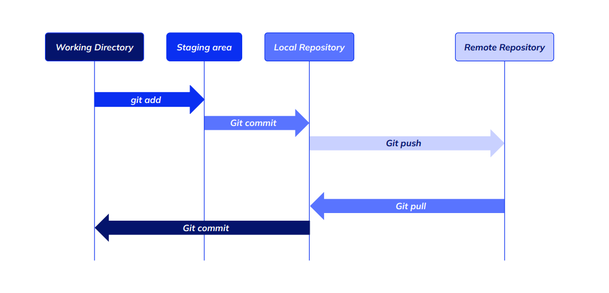

# Clase 02 - Git Desarrollo Colaborativo

# Colaboración de Juan Manuel



## Agrego al área de index (Staging Area) archivos que quiero que sean parte de un nuevo commit

```sh
git add <nombre-archivo>
git add <nombre-archivo1> <nombre-archivo2> <nombre-archivo3>
git add <carpeta>/* # Me agrega todos los archivos que están dentro de una carpeta
git add . # Agrego todos los archivos que figuran con cambios o sin siguimiento  
```

## Comando para guardar lo que está en el Staging Area (index) dentro del repo

```sh
git commit -m <mensaje-descritivo>
git commit -m "Clase 01 - Introducción GIT -> comandos básico"
git commit # Me abre el editor elegido en al instalación para que coloque un mensaje
```

> IMPORTANTE: Solo se usa en el último commit (Siempre que el último no se haya subido subido al remoto)

```sh
git commit --amend -m <mensaje-descritivo-corregido>
```

## Ver las diferencias entre los cambios en WD y el LOCAL REPO

```sh
git diff
```

## Ver las diferencias entre el SA (Stanging Area) y el WD

```sh
git diff --staged
```

## Ver el historico de commit 

```sh
git log # Formato largo
git log --oneline # Formato corto resumido
```

## Ver información extendida de un commit

```sh
git show <hash>
git show f09a53c
```
