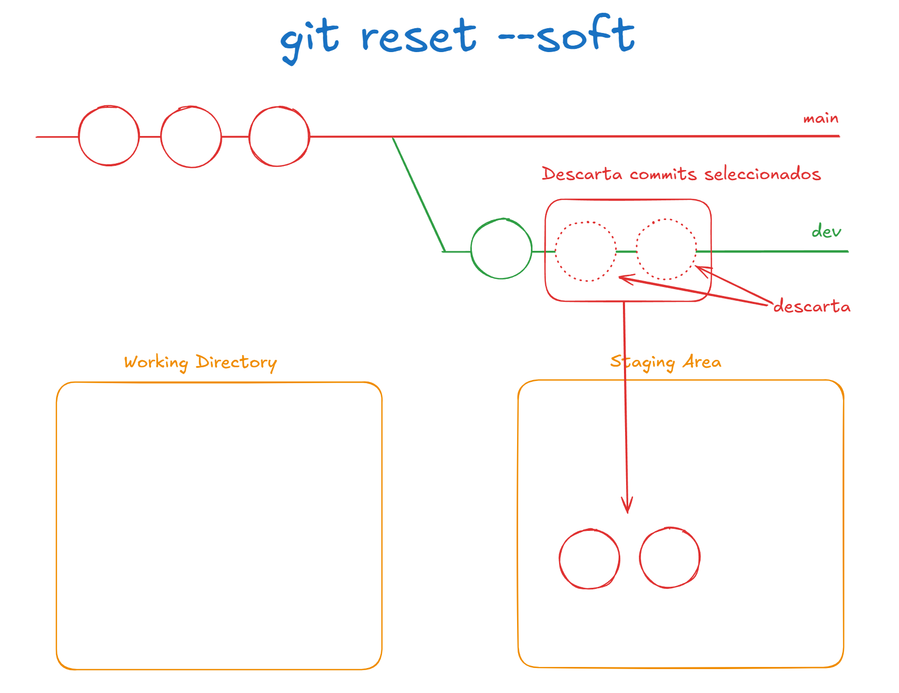
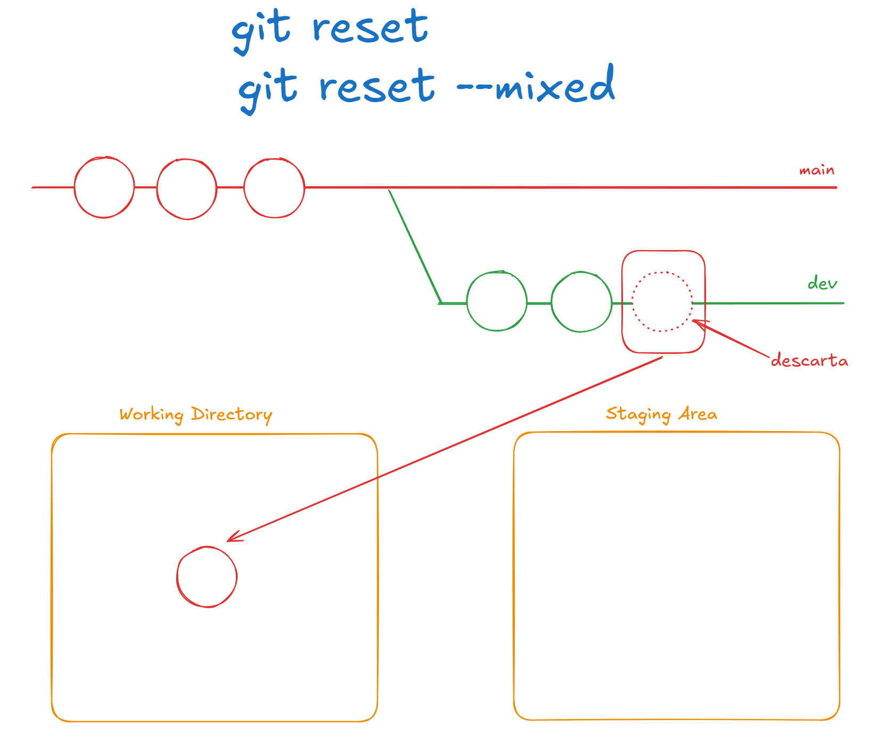
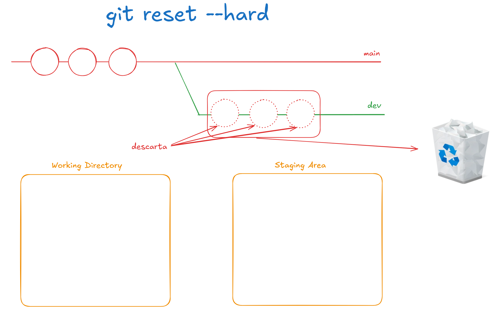

# Clase 05 - Git Desarrollador Colarativo

## Ayuda de Git Stash

```sh
git stash --help
```

## Alias de GIT
Me permite crear alias de comandos para en vez de estar escribiendo el comando y sus subcomandos hacerlo en forma resumida (corta). A través de una letra o una palabra.

### Creo un alias

```sh
git config --global alias.<alias-elegido> "<comando-de-git-sin-la-palabra-git>"
git config --global alias.l "log --oneline"
git config --global alias.ll "log --oneline --all --graph --decorate"
git config --global alias.s "status --short"
git config --global alias.c "commit -m"
```

### Quitar alias

```sh
git config --global --unset alias.ll # Me quita el alias ll
```

### Listar alias configurados

```sh
git config --global --get-regexp alias
```

## GIT RESET
Me permite desahacer un commit o commits (cambios) en el repositorio. Los cambios deshechos se van a colocar en el área de trabajo o el área de staging (index).

### 3 tipos de resets

* Git Reset Soft
* Git Reset Mixed (default)
* Git Reset Hard 

1. Git Reset Soft
Va a borrar el commit o los commits seleccionados y arrojar los cambios al staging area (index)



```sh
git reset --soft <hash>
```

2. Git Reset Mixed (default)
Va a borrar el commit o los commits seleccionados y arrojar el contenido de esos commits dentro del área de Working Directory



```sh
git reset <hash>
git reset --mixed <hash>
```

3. Git Reset Hard **CUIDADO**
Va a borrar el commit o los commits seleccionados y descarta el contenido. O sea los cambios se pierden.



```sh
git reset --hard <hash>
```


